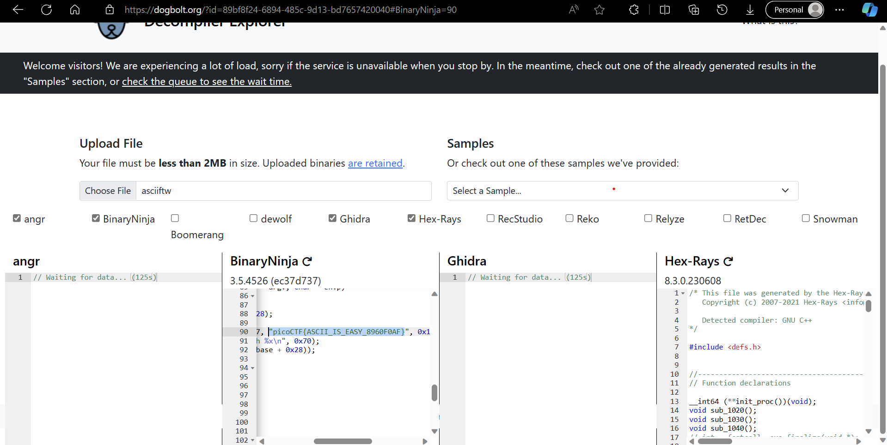

found the file to be of type ELF

```bash
arnavj@ARNAV-PC:/mnt/c/Users/Arnav/Documents/CTF$ file asciiftw
asciiftw: ELF 64-bit LSB pie executable, x86-64, version 1 (SYSV), dynamically linked, interpreter /lib64/ld-linux-x86-64.so.2, BuildID[sha1]=e1c32dace8ac1516160b771e493f5ebffcac9855, for GNU/Linux 3.2.0, not stripped
```

used an online diassember and searched for picoCTF which I found in the main function



The flag,
```
picoCTF{ASCII_IS_EASY_8960F0AF}
```