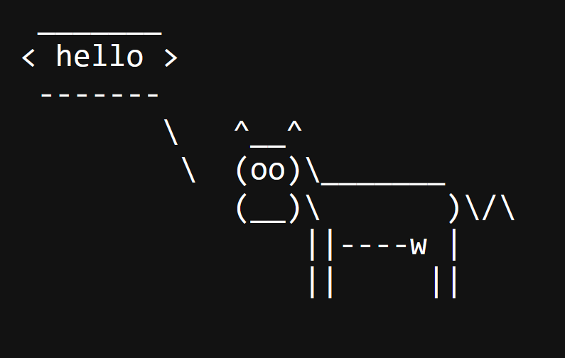
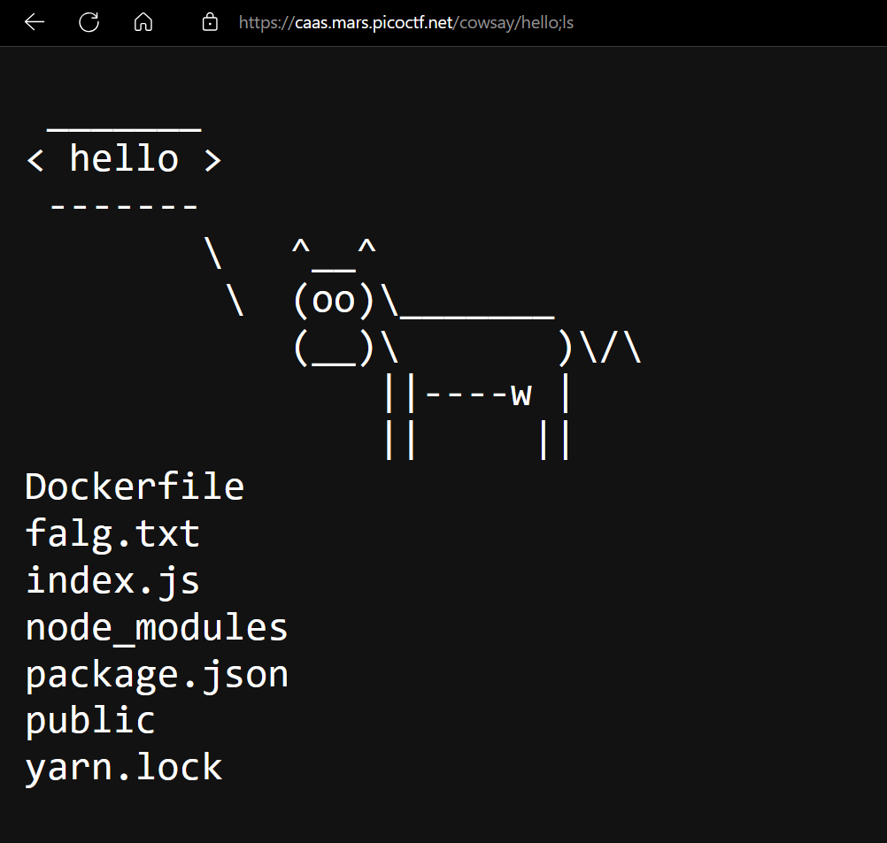
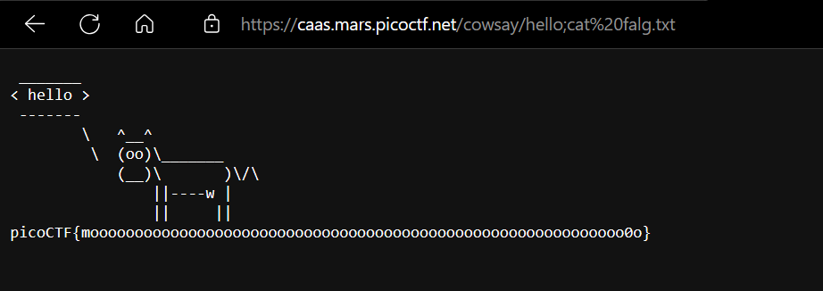

cowsay is utility that works in the terminal. it is capable of generating a cow and displays a message cloud.

so if changing the prompt in the url changes the message then it must be using the website url to run the command in the terminal.

Using command injection, we can run commands like `ls`

`falg.txt` may contain the flag. viewing it using `cat`, we get the flag

we got the flag
