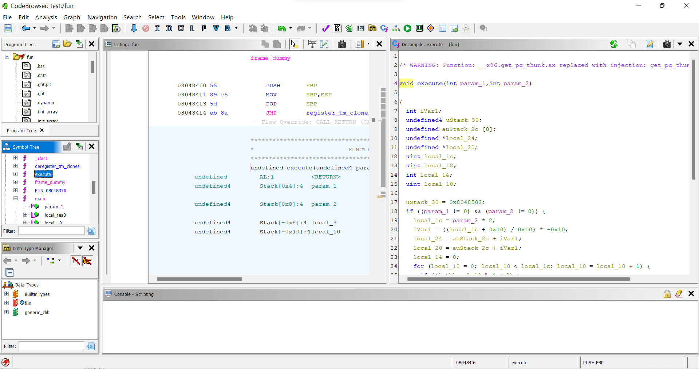
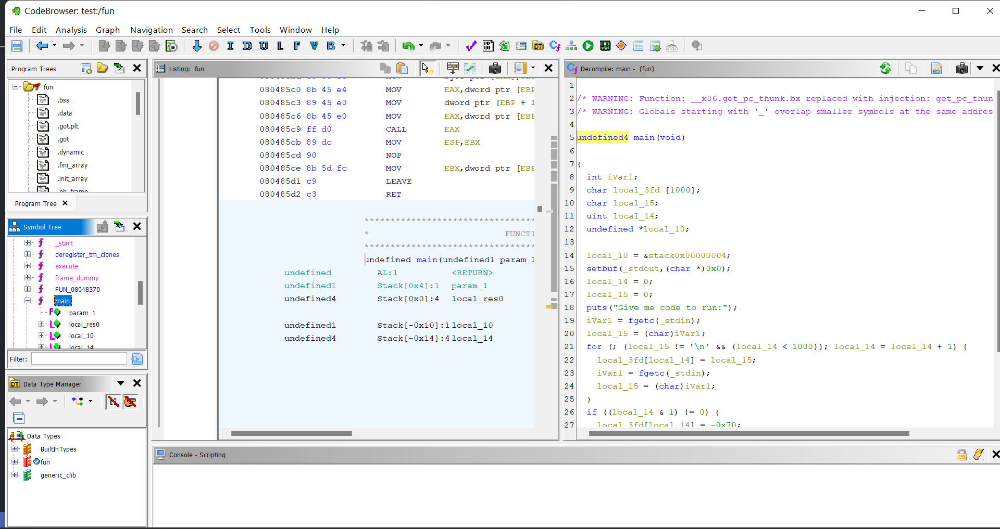

the file `fun` on downloading and then using `strings` hints it to be a c program.

```bash
arnavj@ARNAV-PC:/mnt/c/Users/Arnav/Documents/CTF$ strings fun
/lib/ld-linux.so.2
2^57
libc.so.6
_IO_stdin_used
exit
puts
stdin
fgetc
stdout
setbuf
__libc_start_main
GLIBC_2.0
__gmon_start__
UWVS
[^_]
Give me code to run:
;*2$"
GCC: (Ubuntu 7.5.0-3ubuntu1~18.04) 7.5.0
crtstuff.c
deregister_tm_clones
__do_global_dtors_aux
completed.7283
__do_global_dtors_aux_fini_array_entry
frame_dummy
__frame_dummy_init_array_entry
fun.c
__FRAME_END__
__init_array_end
_DYNAMIC
__init_array_start
__GNU_EH_FRAME_HDR
_GLOBAL_OFFSET_TABLE_
__libc_csu_fini
setbuf@@GLIBC_2.0
__x86.get_pc_thunk.bx
_edata
execute
__data_start
puts@@GLIBC_2.0
__gmon_start__
exit@@GLIBC_2.0
__dso_handle
_IO_stdin_used
__libc_start_main@@GLIBC_2.0
__libc_csu_init
stdin@@GLIBC_2.0
_dl_relocate_static_pie
_fp_hw
fgetc@@GLIBC_2.0
stdout@@GLIBC_2.0
__bss_start
main
__x86.get_pc_thunk.ax
__TMC_END__
.symtab
.strtab
.shstrtab
.interp
.note.ABI-tag
.note.gnu.build-id
.gnu.hash
.dynsym
.dynstr
.gnu.version
.gnu.version_r
.rel.dyn
.rel.plt
.init
.plt.got
.text
.fini
.rodata
.eh_frame_hdr
.eh_frame
.init_array
.fini_array
.dynamic
.got.plt
.data
.bss
.comment
```

so opening the file using `ghidra` and decompiling it gives us the following:

<h3> Main function </h3>



<h3> Execute function </h3>

